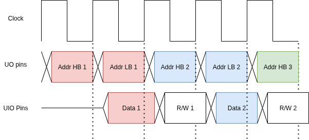

<!---

This file is used to generate your project datasheet. Please fill in the information below and delete any unused
sections.

You can also include images in this folder and reference them in the markdown. Each image must be less than
512 kb in size, and the combined size of all images must be less than 1 MB.
-->

## Foreword
The 6502 resources we found compiled online did not reflect the hardware as much as expected
most likely due to the fact that the provided information was for developers using the 6502 and
not the actual design manual itself. 

We also found that the 6502 was made with some strange practices in mind - at the time, microprocessor design 
space was not as advanced and explored; for instance, modern CPUs do not use multi-phase clock signals.

Thus, we decided to make some educated guesses and edits to 'improve' the design for our use cases, and make things easier.
Finally, our code freeze occured before we could add any ADDR X type instructions (incrementing for arrays), 
which were deemed non-essential as they could be implemented via software (through program editing).

Overall though, our intention is for our 6502 to remain relatively authentic.

## How it works
This project implements a custom 8-bit microprocessor inspired by the 6502 architecture. The design is built around a central Arithmetic Logic Unit (ALU), a collection of registers, and a microcoded instruction decoder that executes a subset of the 6502 instruction set.


### Core Architecture

The processor's operation is coordinated by several key functional blocks:

*   **Instruction Decode:** This is the control center of the CPU. It's a complex finite state machine that reads an instruction from the data bus, interprets its opcode and addressing mode, and generates the internal control signals required to execute it over a series of clock cycles.
*   **Registers:**
    *   **Program Counter (PC):** A 16-bit register that holds the memory address of the next instruction to be fetched.
    *   **Accumulator (A):** An 8-bit register used for most arithmetic and logical operations.
    *   **Index Registers (X and Y):** Two 8-bit registers commonly used for indexed addressing modes and as general-purpose counters or temporary storage.
    *   **Processor Status Register (P):** Contains a set of flags (e.g., Carry, Zero, Negative) that reflect the result of the most recent ALU operation.
*   **Arithmetic Logic Unit (ALU):** The computational core of the processor. It performs all arithmetic (add, increment, decrement), logical (AND, OR, XOR, shift, rotate), and comparison (CPX, CMP, CPY) operations. It takes inputs from the internal buses and updates the Processor Status Register flags based on the outcome of its calculation.
*   **Internal Buses (Bus 1 & Bus 2):** Two internal 8-bit buses that serve as the data highways connecting the registers and ALU, allowing for the transfer of operands and results within the CPU.
*   **I/O Buffers:**
    *   **Address Bus (AB):** An internal 16-bit bus that holds the address for memory operations. Its value is selected from either the PC, a calculated memory address, or the ALU output.
    *   **Input Data Latch:** Temporarily holds data read from the main data bus, typically an instruction operand or address byte.
    *   **Data Bus Buffer:** Temporarily holds data from an internal register before it is written out to the main data bus.

### Operational Cycle

The processor operates on a classic **Fetch-Decode-Execute** cycle controlled by the instruction decoder's state machine:

1.  **Fetch:** The address in the Program Counter (PC) is placed on the Address Bus to read the next instruction byte from memory. This byte is loaded into the instruction decoder. The PC is then incremented.
2.  **Decode:** The decoder logic analyzes the instruction. Based on the opcode, it determines which operation to perform and which addressing mode to use (e.g., Zero Page, Absolute, Immediate). This determines the subsequent states the machine will enter.
3.  **Execute:** The decoder sequences through one or more states to complete the instruction. This multi-cycle process may involve:
    *   Fetching additional bytes from memory for operands or addresses.
    *   Loading data from registers onto the internal buses to be used as ALU inputs.
    *   Triggering an ALU operation.
    *   Capturing the ALU output and flags.
    *   Storing the result back into a register (A, X, or Y) or writing it to a memory location.

## IO Pattern/Clock pattern



A unique characteristic of this design is its clocking scheme. The internal CPU logic runs at **half the frequency of the external `clk` input**.

This is a deliberate design choice to manage the physical pin limitations of the hardware.

*   **Address Bus:** The 16-bit address bus (`ab`) is too wide for the available output pins. It is therefore multiplexed and output via the 8-bit `uo_out` port over two consecutive clock cycles.
*   **Data Bus:** The 8-bit bidirectional data bus is handled by the `uio_in`, `uio_out`, and `uio_oe` pins, whether to read or write to memory is multiplexed with the data we want on the bus(though this is a vestige of before we realized we could just use `uio_oe` and that is the recommended method now, thus you can just ignore the rw flag on the off cycle)

*  **External Memory:** We make the assumption that as soon as the full address has been put to the `uo_out` port, the external memory can return with the value, or finish a write transaction **By the start of the next clock cycle**

## Addressing Modes

The processor supports a variety of addressing modes to provide flexibility in accessing data. The specific mode for an instruction is implicitly defined by its opcode.

In the descriptions below, a "CPU Cycle" refers to a complete state transition in the processor's core logic. Due to the I/O multiplexing scheme, each CPU Cycle takes two cycles of the main input `clk`. 

---

### 1. Implied and Register Addressing

These are the simplest modes. The instruction operates directly on a register or has no operand, so the instruction itself is a single byte.

*   **Example:** `TAX` (Transfer Accumulator to X Register)
*   **Instruction Format:** `8A`
*   **CPU Cycles:** 2
*   **Cycle-by-Cycle Breakdown:**
    *   **Cycle 1 (Fetch Opcode):** The PC is placed onto the address bus, and `8A` is read. The PC is incremented.
    *   **Cycle 2 (Execute):** The value in the Accumulator is placed into X using `bus1` as the intermediary

---

### 2. Accumulator Addressing

In this mode, the instruction operates directly on the Accumulator. Like Implied addressing, it is a single-byte instruction. It is primarily used for shift and rotate operations.

*   **Example:** `ASL A` (Arithmetic Shift Left on Accumulator)
*   **Instruction Format:** `0A`
*   **CPU Cycles:** 4
*   **Cycle-by-Cycle Breakdown:**
    *   **Cycle 1 (Fetch Opcode):** The PC is placed onto the address bus, and `0A` is read. The PC is incremented.
    *   **Cycle 2 (Execute):** The value in the accumulator is sent to the ALU, which is given the `ASL` Opcode and performs the Left Shift operation. The result is calculated and flags are updated.
    *   **Cycle 3 (Transfer Result):** The output from the ALU is written to `bus2` and the Accumulator is told to read from `bus2`
    *   **Cycle 4 (Hold):** The accumulator reads from `bus2` with the final value

---

### 3. Immediate Addressing

The operand for the instruction is the literal value contained in the byte immediately following the opcode.

*   **Example (Load):** `LDA #44` (Load Accumulator with the value `$44`)
*   **Instruction Format:** `A9 44`
*   **CPU Cycles:** 5
*   **Cycle-by-Cycle Breakdown:**
    *   **Cycle 1 (Fetch Opcode):** The PC is placed onto the address bus, and `A9` is read. The PC is incremented.
    *   **Cycle 2 (Read from Memory):** The PC is placed on the address bus. The data at that location is read into the `Input Data Latch`. The PC is Incremented
    *   **Cycle 3 (Transfer Result):** The data from the latch is written to `bus1` and the Accumulator is told to read from `bus1`
    *   **Cycle 4 (Hold):** The accumulator reads from `bus1` with the final value
    *   **Cycle 5 (None):** The cpu does nothing here due to the fixed machine state path

*   **Example (Read-Modify-Write to Accumulator):** `ORA #44` (OR Accumulator with the value `$44`)
*   **Instruction Format:** `09 44`
*   **CPU Cycles:** 5
*   **Cycle-by-Cycle Breakdown:**
    *   **Cycle 1 (Fetch Opcode):** The PC is placed onto the address bus, and `09` is read. The PC is incremented.
    *   **Cycle 2 (Read from Memory):** The PC is placed on the address bus. The data at that location is read into the `Input Data Latch`. The PC is Incremented
    *   **Cycle 3 (Execute):** The data from the latch and the value in the Accumulator is sent to the ALU, which is given the `AND` Opcode and performs the Left Shift operation. The result is calculated and flags are updated.
    *   **Cycle 3 (Transfer Result):** The output from the ALU is written to `bus2` and the Accumulator is told to read from `bus2`
    *   **Cycle 4 (Hold):** The accumulator reads from `bus2` with the final value
---

### 4. Relative Addressing

Like the previous addressing mode, the operand for the instruction is the literal value contained in the byte immediately following the opcode. The operand is an unsigned number who's value is added to the program counter if the branch condition is true.

*   **Example (Load):** `BNE #44` (Increment program counter by `$44` if the zero flag is not set)
*   **Instruction Format:** `D0 44`
*   **CPU Cycles:** 4
*   **Cycle-by-Cycle Breakdown:**
    *   **Cycle 1 (Fetch Opcode):** The PC is placed onto the address bus, and `D0` is read. The PC is incremented.
    *   **Cycle 2 (Read from Memory):** The PC is placed on the address bus. The data at that location is read into the `Input Data Latch`. The PC is Incremented
    *   **Cycle 3 (Increment Program Counter):** The data from the latch is written to `bus1` and the program counter increments by the value in `bus1` if the instruction decode block indicates the condition is met 
    *   **Cycle 4 (None):** The cpu does nothing here due to the fixed machine state path


---

### 5. Zero-Page Addressing

This mode provides faster memory access by using a single byte to specify an address within the first 256 bytes of memory (Page 0, addresses `$0000` to `$00FF`).

*   **Example (Load):** `LDA $44` (Load Accumulator from address `$0044`)
*   **Instruction Format:** `A5 44`
*   **CPU Cycles:** 4
*   **Cycle-by-Cycle Breakdown:**
    *   **Cycle 1 (Fetch Opcode):** Fetches the opcode (`$A5`). PC is incremented.
    *   **Cycle 2 (Fetch ZP Address):** Fetches the operand (`$44`), which is the low byte of the effective address. PC is incremented.
    *   **Cycle 3 (Read from Memory):** The full address (`$0044`) is placed on the address bus. The data at that location is read into the `Input Data Latch`.
    *   **Cycle 4 (Writeback):** The value is loaded from the Input Data Latch into the Accumulator.

*   **Example (Read-Modify-Write To Accumulator):** `AND $44` (AND the Accumulator and the byte at address `$0044` and write to the Accumulator)
*   **Instruction Format:** `25 44`
*   **CPU Cycles:** 6
*   **Cycle-by-Cycle Breakdown:**
    *   **Cycle 1 (Fetch Opcode):** The PC is placed onto the address bus, and `25` is read. The PC is incremented.
    *   **Cycle 2 (Fetch ZP Address):** Fetches the operand (`$44`), which is the low byte of the effective address. PC is incremented.
    *   **Cycle 3 (Read from Memory):** The full address (`$0044`) is placed on the address bus. The data at that location is read into the `Input Data Latch`.
    *   **Cycle 4 (Execute):** The data from the latch and the value in the Accumulator is sent to the ALU, which is given the `AND` Opcode and performs the Left Shift operation. The result is calculated and flags are updated.
    *   **Cycle 5 (Transfer Result):** The output from the ALU is written to `bus2` and the Accumulator is told to read from `bus2`
    *   **Cycle 6 (Hold):** The accumulator reads from `bus2` with the final value

*   **Example (Read-Modify-Write To Memory):** `ASL $44` (Arithmetic Shift Left on the byte at address `$0044`)
*   **Instruction Format:** `06 44`
*   **CPU Cycles:** 7
*   **Cycle-by-Cycle Breakdown:**
    *   **Cycle 1 (Fetch Opcode):** The PC is placed onto the address bus, and `0A` is read. The PC is incremented.
    *   **Cycle 2 (Fetch ZP Address):** Fetches the operand (`$44`), which is the low byte of the effective address. PC is incremented.
    *   **Cycle 3 (Read from Memory):** The full address (`$0044`) is placed on the address bus. The data at that location is read into the `Input Data Latch`.
    *   **Cycle 4 (Execute):** The data from the latch is sent to the ALU, which is given the `ASL` Opcode and performs the Left Shift operation. The result is calculated and flags are updated.
    *   **Cycle 5 (Transfer to Buffer):** The output value from the ALU is loaded into the `Data Bus Buffer` 
    *   **Cycle 6 (Writeback to Memory):** The HB of the address (`$00`) is placed on the address bus, and the `Data Bus Buffer` content is written to the IO Bus.
    *   **Cycle 7 (Write Address LB to address bus):** The LB of the address (`$44`) is placed on the address bus, and the IO Bus content is written to memory(this step is mostly off chip)
---

### 6. Absolute Addressing

This mode uses a full 16-bit address to access any location in the 64KB memory space. The address follows the opcode as two bytes in little-endian format (low byte first).

*   **Example (Read-Modify-Write To Accumulator):** `EOR $1234` (XOR the Accumulator and the byte at address `$1234` and write to the Accumulator)
*   **Instruction Format:** `4d 44`
*   **CPU Cycles:** 7
*   **Cycle-by-Cycle Breakdown:**
    *   **Cycle 1 (Fetch Opcode):** The PC is placed onto the address bus, and `25` is read. The PC is incremented.
    *   **Cycle 2 (Fetch Address Low Byte):** Fetches the low byte of the address (`$34`) and writes it to an internal buffer. PC is incremented.
    *   **Cycle 3 (Fetch Address High Byte):** Fetches the high byte of the address (`$12`). The full address `$1234` is now assembled. PC is incremented.
    *   **Cycle 3 (Read from Memory):** The full address (`$0044`) is placed on the address bus. The data at that location is read into the `Input Data Latch`.
    *   **Cycle 4 (Execute):** The data from the latch and the value in the Accumulator is sent to the ALU, which is given the `AND` Opcode and performs the Left Shift operation. The result is calculated and flags are updated.
    *   **Cycle 5 (Transfer Result):** The output from the ALU is written to `bus2` and the Accumulator is told to read from `bus2`
    *   **Cycle 6 (Hold):** The accumulator reads from `bus2` with the final value

*   **Example (Read-Write-Modify to Memory):** `STA $1234` (Store Accumulator at address `$1234`)
*   **Instruction Format:** `8D 34 12`
*   **CPU Cycles:** 8
*   **Cycle-by-Cycle Breakdown:**
    *   **Cycle 1 (Fetch Opcode):** The PC is placed onto the address bus, and `8D` is read. The PC is incremented.
    *   **Cycle 2 (Fetch Address Low Byte):** Fetches the low byte of the address (`$34`) and writes it to an internal buffer. PC is incremented.
    *   **Cycle 3 (Fetch Address High Byte):** Fetches the high byte of the address (`$12`). The full address `$1234` is now assembled. PC is incremented.
    *   **Cycle 4 (Read from Memory):** The hardware reads from the target address (`$1234`). For a store instruction, this read is superfluous but occurs due to the fixed state machine path.
    *   **Cycle 5 (Execute):** The ALU performs no meaningful operation for a store instruction.
    *   **Cycle 6 (Transfer to Buffer):** The value in the Accumulator is placed on `bus2` and loaded into the `Data Bus Buffer`.
    *   **Cycle 7 (Writeback to Memory):** The HB of the address (`$12`) is placed on the address bus, and the `Data Bus Buffer` content is written to the IO Bus.
    *   **Cycle 8 (Write Address LB to address bus):** The LB of the address (`$34`) is placed on the address bus, and the IO Bus content is written to memory(this step is mostly off chip)


## How to test

Verifying a processor design like this 6502 requires a robust testing strategy. The following sections describe two detailed approaches for ensuring its correctness, each with its own strengths.

### Cycle-Accurate Testbench Emulation

This approach uses a testbench that acts as an intelligent and perfect memory system. Instead of simulating a passive RAM block, the testbench actively interacts with the CPU on a cycle-by-cycle basis. It precisely controls the data fed to the processor and meticulously verifies the signals coming out of it at every stage of an instruction's execution.

This methodology provides extremely granular control and visibility, allowing for the verification of both the logical outcome of an instruction and its exact timing. A typical test for a single instruction follows these steps:

1.  **Initiate Instruction:** The testbench begins by placing the instruction's opcode onto the `uio_in` pins at the exact moment the CPU is ready to fetch it.
2.  **Monitor Address Bus:** The processor outputs the 16-bit address of the memory location it intends to access (e.g., the address held in the Program Counter). This address is multiplexed onto the 8-bit `uo_out` port over two clock cycles (High Byte, then Low Byte). The testbench reads both bytes, reassembles the full address, and asserts that it is correct for the current step in the operation.
3.  **Emulate Memory Read:** When the CPU needs to fetch an operand, such as an address byte or an immediate value, the testbench waits for the correct address to appear on `uo_out` and for the `rw` signal to indicate a read operation. It then immediately places the required data onto the `uio_in` pins, perfectly emulating a memory device responding to a read request.
4.  **Verify Memory Write:** If an instruction results in a memory write (like `STA` or a read-modify-write instruction such as `ASL`), the testbench verifies several key signals to confirm the write is correct:
    *   The correct destination address is present on the `uo_out` port.
    *   The correct data value is being driven by the CPU onto the `uio_out` pins.
    *   The I/O direction pin, `uio_oe`, is asserted high to enable the output driver.
    *   The `rw` (read/write) signal is driven low to indicate a write cycle.
5.  **Check Final State:** Once the instruction is complete, the testbench runs subsequent instructions to read the contents of the affected register (Accumulator, X, or Y) or memory location. This allows verification that the instruction had the intended final effect on the processor's state.

This is the method that our instruction specific cocotb tests follow.

### System-Level Program Execution

An alternative testing philosophy involves a more traditional, system-level simulation. In this scenario, the CPU is tested as one component within a larger, simulated system that more closely resembles a real-world computer. This approach is less focused on the individual cycles of an instruction and more on the processor's ability to execute a sequence of instructions correctly.

The process for this type of test would be:

1.  **Instantiate a Full System:** The test setup would include the CPU Verilog model alongside a Verilog model of a RAM block and any other necessary peripherals.
2.  **Pre-load Program:** Before the simulation begins, a complete program—a binary sequence of machine code—is loaded into the simulated RAM model.
3.  **Free-Run Execution:** The CPU is reset and then allowed to run freely. It will begin fetching instructions from the simulated RAM, starting from the reset vector address, and execute the program autonomously without direct cycle-by-cycle intervention from the testbench.
4.  **Verify Final State:** After a predetermined number of clock cycles or upon reaching a `NOP` or halt instruction, the simulation is paused. The testbench then reads the final state of the CPU's internal registers and specific, relevant memory locations within the simulated RAM. This final state is compared against a known-good result to determine if the program executed successfully.

This method excels at verifying the processor's capability to run larger, more complex software, but provides less direct insight into the low-level timing and signal behavior of individual instructions.

This is the method that our fuzzing cocotb tests follow.

Examples of these testing methods can be found in our test.py file, any function that include the word `fuzz` in their name follow method 2 and every other test follows method 1

## Programming Guide

This guide provides the essential information needed to write assembly-level programs for this 6502-inspired processor. Adhering to these guidelines is critical for ensuring your code runs correctly.

### Startup and Initialization

On power-up or after a reset, the processor's internal state is initialized as follows:

*   **Program Counter (PC):** The PC is set to `$0000`. The processor will immediately attempt to fetch its first instruction from this memory address.

*   **Mandatory NOP Instruction:** For proper initialization and predictable execution, the first instruction at memory address `$0000` **must** be a `NOP` (`$EA`). The processor uses this initial two-cycle instruction to correctly align its internal state machine. Your program's main logic should begin at address `$0001`.

### Contiguous Memory Layout

Your program's machine code (the binary opcodes and operands) must be stored as a continuous block in memory. The processor fetches instructions sequentially, and after an instruction completes, the Program Counter will point to the very next memory address. It expects to find the opcode of the next instruction at that exact location.

You cannot leave empty or unused bytes between your instructions, as the processor would attempt to interpret whatever data is in that gap as a valid instruction, leading to a crash or undefined behavior (though given how we have designed the CPU, it will most likely just be a NOP).

For example, if a 3-byte instruction like `STA $0210` starts at address `$0003`, it will occupy addresses `$0003` (opcode), `$0004` (operand low byte), and `$0005` (operand high byte). The very next instruction in your program **should** begin at address `$0006`.

### Known Hardware Limitations

*   **Page Boundary Bug:** There is a known limitation in this hardware implementation that prevents reliable memory access to the **final byte of any memory page**. Programmers must ensure that no instruction opcodes, operands, or data addresses are placed at a memory location ending in `$FF` (e.g., `$00FF`, `$01FF`, `$C3FF`, etc.). Accessing these specific addresses will lead to unpredictable behavior and program failure.

### Example Program: 8-Bit Multiplication

Here is a program that multiplies two 8-bit numbers using repeated addition. This demonstrates looping, branching, and memory manipulation. The program multiplies the number at address `$00FA` by the number at `$00FB` and stores the 8-bit result at `$00FC`.

```assembly
; Program to multiply Number A ($FA) by Number B ($FB).
; The final 8-bit result is stored in $FC.

; --- Memory Setup ---
; $FA: Multiplicand (Number A)
; $FB: Multiplier   (Number B, used as the loop counter)
; $FC: Result      (Initialized to 0)

; --- Initialization ---
$0000: EA      ; Mandatory NOP for startup.

$0001: A9 00 ; LDA #$00. Clear the accumulator.
$0003: 85 FC ; STA $FC. Initialize the result location at $FC to zero.

; --- Main Loop and Comparison ---
$0005: A5 FB ; Load the counter (B) from memory into the accumulator.
$0007: C9 00 ; CMP #$00. Compare the accumulator's value with the 
             ; immediate value 0.
             ; This sets the Zero flag if the counter has reached zero.
$0009: F0 0C ; BEQ end_program. If the Zero flag is set (counter is 0),
             ; branch to the end.
             ; Branch target: Current PC+2+offset = $000B + $0C = $0017.

; --- Loop Body (Executes if B is not zero) ---
$000B: C6 FB ; DEC $FB. Decrement the counter value in memory.
$000D: A5 FC ; LDA $FC. Load the current running total from memory into
             ;the accumulator.
$000F: 65 FA ; ADC $FA. Add number A to the running total.
$0011: 85 FC ; STA $FC. Store the new total back into the result location.
$0013: 4C 05 00 ; JMP loop. Jump unconditionally back to the start
                ;of the loop.

; --- End of Program ---
; The final result is already in memory at $FC. We can halt here.
$0016: 4C 16 00    ; JMP end_program. Halt the CPU by jumping 
                   ;to the same address indefinitely.
```

This program correctly follows all guidelines: it starts with a `NOP` at `$0000`, the machine code is laid out sequentially without gaps, and it avoids placing any code or data at an `xxFF` address.

## Addendum 1

Table of Supported Instructions:

|Instruction Name                   | Instruction Format | Time Taken      | Flags Changed |
|-----------------------------------|--------------------|-----------------|---------------|
|ARITHMETIC ZPG INSTRUCTIONS                                                               |
|-----------------------------------|--------------------|-----------------|---------------|
|ASL ZPG (Arithmatic Shift Left)    | 06 addr-lb         | 7               |  N Z C - - -  |
|LSR ZPG (Logical Shift Right)      | 46 addr-lb         | 7               |  0 Z C - - -  |
|ROL ZPG (Roll Byte Left)           | 26 addr-lb         | 7               |  N Z C - - -  |
|ROR ZPG (Roll Byte Right)          | 46 addr-lb         | 7               |  N Z C - - -  |
|INC ZPG (Increment Byte)           | e6 addr-lb         | 7               |  N Z - - - -  |
|DEC ZPG (Decrement Byte)           | c6 addr-lb         | 7               |  N Z - - - -  |
|AND ZPG (AND Byte with Acc)        | 35 addr-lb         | 6               |  N Z - - - -  |
|ORA ZPG (OR Byte with Acc)         | 05 addr-lb         | 6               |  N Z - - - -  |
|EOR ZPG (XOR Byte with Acc)        | 55 addr-lb         | 6               |  N Z - - - -  |
|ADC ZPG (Add Byte with Acc)        | 65 addr-lb         | 6               |  N Z C - - -  |
|SBC ZPG (Subtract Byte with Acc)   | e5 addr-lb         | 6               |  N Z C - - -  |
|-----------------------------------|--------------------|-----------------|---------------|
|STORE ZPG INSTRUCTIONS                                                                    |
|-----------------------------------|--------------------|-----------------|---------------|
|STY ZPG (Store Y)                  | 84 addr-lb         | 7               |  - - - - - -  |
|STA ZPG (Store Accumulator)        | 85 addr-lb         | 7               |  - - - - - -  |
|STX ZPG (Store X)                  | 86 addr-lb         | 7               |  - - - - - -  |
|-----------------------------------|--------------------|-----------------|---------------|
|LOAD ZPG INSTRUCTIONS                                                                     |
|-----------------------------------|--------------------|-----------------|---------------|
|LDY ZPG (Load Y)                   | a4 addr-lb         | 6               |  - - - - - -  |
|LDA ZPG (Load Accumulator)         | a5 addr-lb         | 6               |  - - - - - -  |
|LDX ZPG (Load X)                   | a6 addr-lb         | 6               |  - - - - - -  |
|-----------------------------------|--------------------|-----------------|---------------|
|COMPARE INSTRUCTIONS                                                                      |
|-----------------------------------|--------------------|-----------------|---------------|
|CPX ZPG (Compare X with ZPG)       | e4 addr-lb         | 6               |  N Z C - - -  |
|CPX ABS (Compare X with ABS)       | ec addr-lb addr-hb | 7               |  N Z C - - -  |
|CPX IMM (Compare X with IMM)       | e0 imm             | 5               |  N Z C - - -  |
|CMP ZPG (Compare Acc with ZPG)     | c5 addr-lb         | 6               |  N Z C - - -  |
|CMP ABS (Compare Acc with ABS)     | cd addr-lb addr-hb | 7               |  N Z C - - -  |
|CMP IMM (Compare Acc with IMM)     | c9 imm             | 5               |  N Z C - - -  |
|CPY ZPG (Compare Y with ZPG)       | c4 addr-lb         | 6               |  N Z C - - -  |
|CPY ABS (Compare Y with ABS)       | cc addr-lb addr-hb | 7               |  N Z C - - -  |
|CPY IMM (Compare Y with IMM)       | c0 imm             | 5               |  N Z C - - -  |
|-----------------------------------|--------------------|-----------------|---------------|
BRANCH INSTRUCTIONS                                                                |
|-----------------------------------|--------------------|-----------------|---------------|
|BPL REL (Branch if Negative flag is 0)       | 10 rel             | 4               |  - - - - - -  |
|BMI REL (Branch if Negative flag is 1)       | 30 rel             | 4               |  - - - - - -  |
|BCC REL (Branch if Carry flag is 0)       | 90 rel             | 4               |  - - - - - -  |
|BCS REL (Branch if Carry flag is 1)       | b0 rel             | 4               |  - - - - - -  |
|BNE REL (Branch if Zero flag is 0)       | d0 rel             | 4               |  - - - - - -  |
|BEQ REL (Branch if Zero flag is 1)       | f0 rel             | 4               |  - - - - - -  |
|-----------------------------------|--------------------|-----------------|---------------|
|TRANSFER INSTRUCTIONS                                                                     |
|-----------------------------------|--------------------|-----------------|---------------|
|TXA (Transfer from X to Acc)       | 8a                 | 2               |  - - - - - -  |
|TYA (Transfer from Y to Acc)       | 98                 | 2               |  - - - - - -  |
|TAX (Transfer from Acc to X)       | aa                 | 2               |  - - - - - -  |
|TAY (Transfer from Acc to Y)       | a8                 | 2               |  - - - - - -  |
|-----------------------------------|--------------------|-----------------|---------------|
|ARITHMETIC ABS INSTRUCTIONS                                                               |
|-----------------------------------|--------------------|-----------------|---------------|
|ASL ABS (Arithmatic Shift Left)    | 0e addr-lb addr-hb | 8               |  N Z C - - -  |
|LSR ABS (Logical Shift Right)      | 4e addr-lb addr-hb | 8               |  0 Z C - - -  |
|ROL ABS (Roll Byte Left)           | 2e addr-lb addr-hb | 8               |  N Z C - - -  |
|ROR ABS (Roll Byte Right)          | 4e addr-lb addr-hb | 8               |  N Z C - - -  |
|INC ABS (Increment Byte)           | ce addr-lb addr-hb | 8               |  N Z - - - -  |
|DEC ABS (Decrement Byte)           | ee addr-lb addr-hb | 8               |  N Z - - - -  |
|AND ABS (AND Byte with Acc)        | 3d addr-lb addr-hb | 7               |  N Z - - - -  |
|ORA ABS (OR Byte with Acc)         | 0d addr-lb addr-hb | 7               |  N Z - - - -  |
|EOR ABS (XOR Byte with Acc)        | 5d addr-lb addr-hb | 7               |  N Z - - - -  |
|ADC ABS (Add Byte with Acc)        | 6d addr-lb addr-hb | 7               |  N Z C - - V  |
|SBC ABS (Subtract Byte with Acc)   | ed addr-lb addr-hb | 7               |  N Z C - - V  |
|-----------------------------------|--------------------|-----------------|---------------|
|STORE ABS INSTRUCTIONS                                                                    |
|-----------------------------------|--------------------|-----------------|---------------|
|STY ABS (Store Y)                  | 8c addr-lb addr-hb | 8               |  - - - - - -  |
|STA ABS (Store Accumulator)        | 8d addr-lb addr-hb | 8               |  - - - - - -  |
|STX ABS (Store X)                  | 8e addr-lb addr-hb | 8               |  - - - - - -  |
|-----------------------------------|--------------------|-----------------|---------------|
|LOAD ABS INSTRUCTIONS                                                                     |
|-----------------------------------|--------------------|-----------------|---------------|
|LDY ABS (Load Y)                   | ac addr-lb addr-hb | 7               |  - - - - - -  |
|LDA ABS (Load Accumulator)         | ad addr-lb addr-hb | 7               |  - - - - - -  |
|LDX ABS (Load X)                   | ae addr-lb addr-hb | 7               |  - - - - - -  |
|-----------------------------------|--------------------|-----------------|---------------|
|ARITHMETIC IMM INSTRUCTIONS                                                               |
|-----------------------------------|--------------------|-----------------|---------------|
|ASL IMM (Arithmatic Shift Left)    | 09 imm             | 5               |  N Z C - - -  |
|LSR IMM (Logical Shift Right)      | 49 imm             | 5               |  0 Z C - - -  |
|ROL IMM (Roll Byte Left)           | 29 imm             | 5               |  N Z C - - -  |
|ROR IMM (Roll Byte Right)          | 49 imm             | 5               |  N Z C - - -  |
|SBC IMM (Subtract Byte against Acc)| e9 imm             | 5               |  N Z C - - V  |
|-----------------------------------|--------------------|-----------------|---------------|
|LOAD IMM INSTRUCTIONS                                                                     |
|-----------------------------------|--------------------|-----------------|---------------|
|LDY IMM (Load Y)                   | a0 imm             | 5               |  - - - - - -  |
|LDA IMM (Load Accumulator)         | a9 imm             | 5               |  - - - - - -  |
|LDX IMM (Load X)                   | a2 imm             | 5               |  - - - - - -  |
|-----------------------------------|--------------------|-----------------|---------------|
|INC/DEC REGISTER INSTRUCTIONS                                                             |
|-----------------------------------|--------------------|-----------------|---------------|
|INX (Increment X)                  | e8                 | 4               |  - - - - - -  |
|INY (Increment Y)                  | c8                 | 4               |  - - - - - -  |
|DEX (Decrement X)                  | ca                 | 4               |  - - - - - -  |
|DEY (Decrement Y)                  | 88                 | 4               |  - - - - - -  |
|-----------------------------------|--------------------|-----------------|---------------|
|ARITHMETIC ACC INSTRUCTIONS                                                               |
|-----------------------------------|--------------------|-----------------|---------------|
|ASL A (Arithmatic Shift Left Acc)  | 0a                 | 4               |  N Z C - - -  |
|LSR A (Logical Shift Right Acc)    | 4a                 | 4               |  N Z C - - -  |
|ROL A (Roll Byte Left Acc)         | 2a                 | 4               |  N Z C - - -  |
|ROR A (Roll Byte Right Acc)        | 6a                 | 4               |  N Z C - - -  |
|-----------------------------------|--------------------|-----------------|---------------|
|OTHER INSTRUCTIONS                                                                        |
|-----------------------------------|--------------------|-----------------|---------------|
|NOP (No Op)                        | ea                 | 2               |  - - - - - -  |
|JMP ABS (Jump)                     | 4c addr-lb addr-hb | 4               |  - - - - - -  |
|CLC REL (Clear Carry Flag)       | 18              | 2               |  - - 0 - - -  |
|SEC REL (Set Carry Flag)       | 38              | 2               |  - - 1 - - -  |


